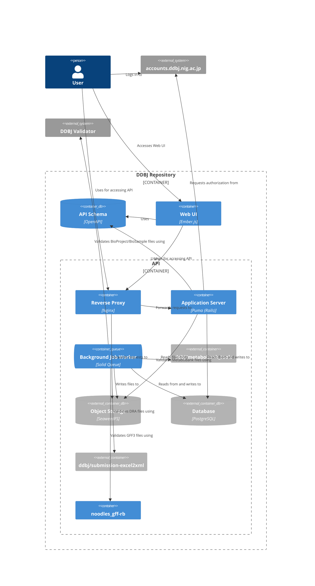
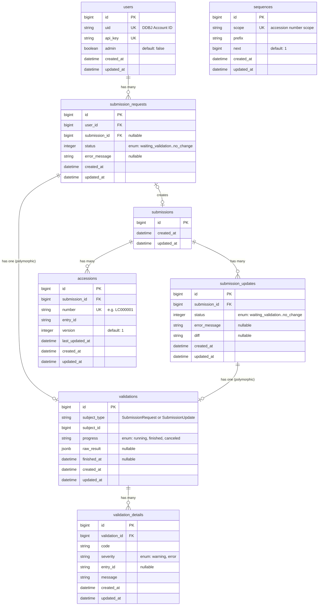

# DDBJ Repository

A submission management system for [DDBJ (DNA Data Bank of Japan)](https://www.ddbj.nig.ac.jp/). Users submit sequence data in ST.26 XML format, which is validated, assigned accession numbers, and converted to DDBJ flatfiles.

## Architecture



## Database Schema



## Tech Stack

- **Backend:** Ruby on Rails, Puma, Solid Queue
- **Frontend:** Ember.js (Octane), TypeScript, Vite
- **Database:** PostgreSQL
- **Object Storage:** SeaweedFS (S3-compatible)
- **Deployment:** Kamal
- **API Schema:** OpenAPI

## Development

### Prerequisites

- Ruby (see `.ruby-version`)
- Node.js + pnpm
- PostgreSQL
- SeaweedFS

### Setup

```sh
bin/setup
```

### Running

```sh
bin/dev
```

### Deployment

```sh
bin/kamal deploy -d staging
bin/kamal deploy -d production
```
