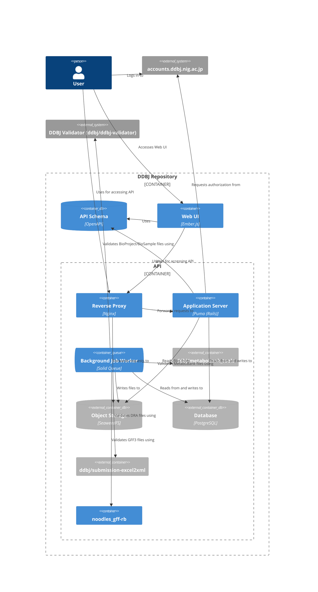
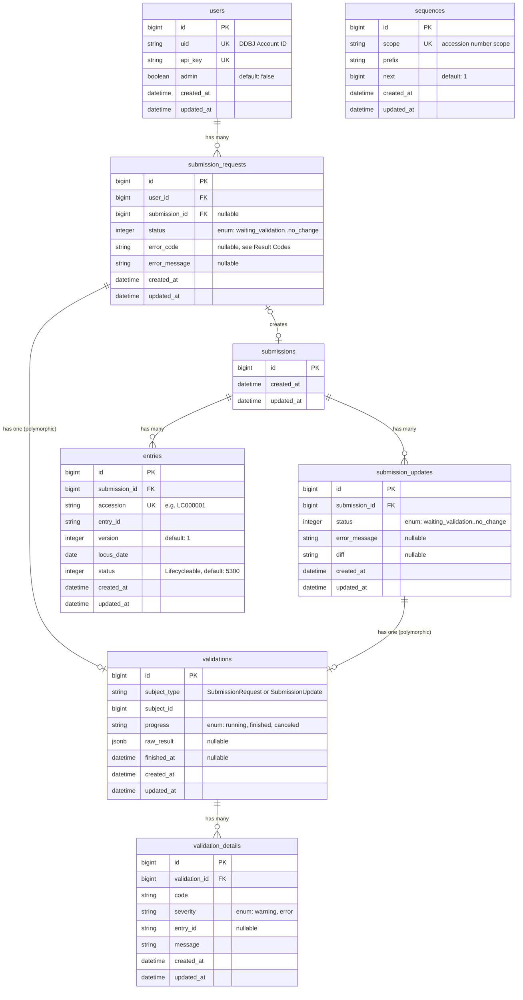

# DDBJ Repository

A submission management system for [DDBJ (DNA Data Bank of Japan)](https://www.ddbj.nig.ac.jp/). Users submit sequence data in ST.26 XML format, which is validated, assigned accession numbers, and converted to DDBJ flatfiles.

## Architecture


```mermaid
C4Container

Person(user, "User")

System_Ext(accounts, "accounts.ddbj.nig.ac.jp")
System_Ext(ddbj_validator, "DDBJ Validator (ddbj/ddbj-validator)")

Container_Boundary(repository, "DDBJ Repository") {
    ContainerDb(schema, "API Schema", "OpenAPI")
    Container(web, "Web UI", "Ember.js")

    Container_Boundary(api, "API") {
        Container(proxy, "Reverse Proxy", "Nginx")
        Container(app, "Application Server", "Puma (Rails)")
        ContainerQueue(worker, "Background Job Worker", "Solid Queue")
        Container_Ext(mb_tools, "ddbj/metabobank_tools")
        ContainerDb_Ext(object_storage, "Object Storage", "SeaweedFS")
        ContainerDb_Ext(db, "Database", "PostgreSQL")
        Container_Ext(excel2xml, "ddbj/submission-excel2xml")
        Container(noodles-gff, "noodles_gff-rb")
    }
}

Rel(user, accounts, "Logs in to")
Rel(user, proxy, "Uses for accessing API")
Rel(user, web, "Accesses Web UI")

Rel(web, schema, "Uses")
Rel(web, proxy, "Uses for accessing API")

Rel(proxy, app, "Forwards requests to")
Rel(proxy, object_storage, "Forwards requests to")

Rel(app, accounts, "Requests authorization from")
Rel(app, schema, "Uses")
Rel(app, db, "Reads from and writes to")
Rel(app, object_storage, "Reads files from")

Rel(worker, object_storage, "Writes files to")
Rel(worker, db, "Reads from and writes to")
Rel(worker, ddbj_validator, "Validates BioProject/BioSample files using")
Rel(worker, mb_tools, "Validates MetaboBank files using")
Rel(worker, excel2xml, "Validates DRA files using")
Rel(worker, noodles-gff, "Validates GFF3 files using")
```

## Database Schema


```mermaid
erDiagram
    users {
        bigint id PK
        string uid UK "DDBJ Account ID"
        string api_key UK
        boolean admin "default: false"
        datetime created_at
        datetime updated_at
    }

    submissions {
        bigint id PK
        datetime created_at
        datetime updated_at
    }

    submission_requests {
        bigint id PK
        bigint user_id FK
        bigint submission_id FK "nullable"
        integer status "enum: waiting_validation..no_change"
        string error_code "nullable, see Result Codes"
        string error_message "nullable"
        datetime created_at
        datetime updated_at
    }

    submission_updates {
        bigint id PK
        bigint submission_id FK
        integer status "enum: waiting_validation..no_change"
        string error_message "nullable"
        string diff "nullable"
        datetime created_at
        datetime updated_at
    }

    entries {
        bigint id PK
        bigint submission_id FK
        string accession UK "e.g. LC000001"
        string entry_id
        integer version "default: 1"
        date locus_date
        integer status "Lifecycleable, default: 5300"
        datetime created_at
        datetime updated_at
    }

    validations {
        bigint id PK
        string subject_type "SubmissionRequest or SubmissionUpdate"
        bigint subject_id
        string progress "enum: running, finished, canceled"
        jsonb raw_result "nullable"
        datetime finished_at "nullable"
        datetime created_at
        datetime updated_at
    }

    validation_details {
        bigint id PK
        bigint validation_id FK
        string code
        string severity "enum: warning, error"
        string entry_id "nullable"
        string message
        datetime created_at
        datetime updated_at
    }

    sequences {
        bigint id PK
        string scope UK "accession number scope"
        string prefix
        bigint next "default: 1"
        datetime created_at
        datetime updated_at
    }

    users ||--o{ submission_requests : "has many"
    submission_requests |o--o| submissions : "creates"
    submissions ||--o{ submission_updates : "has many"
    submissions ||--o{ entries : "has many"
    submission_requests ||--o| validations : "has one (polymorphic)"
    submission_updates ||--o| validations : "has one (polymorphic)"
    validations ||--o{ validation_details : "has many"
```

## Result Codes

One flat `TRD_R` series covering both phases. Validation codes appear per finding
in `validation_details.code`; application codes appear once per request in
`submission_requests.error_code`. `TRD_R9999` is the catch-all for either.

Branch on the code rather than on the accompanying message, whose wording changes
without notice, and treat an unrecognised code the same as `TRD_R9999` — codes are
added as failures are classified, so the set grows.

| Code | Phase | Severity | Description |
|------|-------|----------|-------------|
| TRD_R0001 | validation | error | ApplicationNumberText contains invalid characters (only alphanumeric, hyphen, and slash are allowed) |
| TRD_R0002 | validation | error | Sequence length is zero |
| TRD_R0003 | validation | error | N-only nucleotide sequence |
| TRD_R0004 | validation | error | X-only amino acid sequence |
| TRD_R0005 | validation | error | Invalid characters in nucleotide sequence |
| TRD_R0006 | validation | warning | Undefined feature key |
| TRD_R0007 | validation | warning | Undefined qualifier key |
| TRD_R0008 | validation | error | Invalid presence of qualifier value (missing value for non-boolean qualifier, or value present for boolean qualifier) |
| TRD_R0009 | validation | error | ST.26 fields (applicant/inventor names, invention titles) contain non-ASCII characters |
| TRD_R0010 | validation | error | No source feature with mol_type found |
| TRD_R0011 | validation | warning | ApplicationNumberText is not in the expected format of yyyy-nnnnnn |
| TRD_R0012 | application | error | No accession numbers left in the scope; extend its prefix list in `config/sequence.yml`. Nothing was consumed — no accession was burned and no submission created — so once it is extended the file can be submitted afresh |
| TRD_R0013 | validation | error | The entry disagrees with itself about its length: a source location that does not span the sequence, a declared `length` that does not match it, or a location that cannot be read at all. LOCUS is printed from the length and both the source lines and the REFERENCE span from the locations, so all of them have to agree. Never corrected automatically — only the producer knows which one was meant |
| TRD_R9999 | both | error | Unexpected internal error |

## Tech Stack

- **Backend:** Ruby on Rails, Puma, Solid Queue
- **Frontend:** Ember.js (Octane), TypeScript, Vite
- **Database:** PostgreSQL
- **Object Storage:** SeaweedFS (S3-compatible)
- **Deployment:** Kamal
- **API Schema:** OpenAPI

## Development

### Prerequisites

- Ruby (see `.ruby-version`)
- Node.js + pnpm
- PostgreSQL
- SeaweedFS

### Setup

```sh
bin/setup
```

### Running

```sh
bin/dev
```

### Deployment

```sh
bin/kamal deploy -d staging
bin/kamal deploy -d production
```
